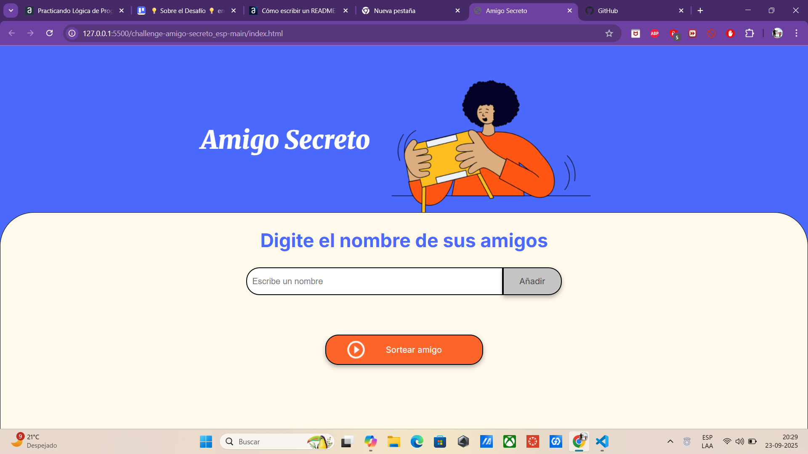
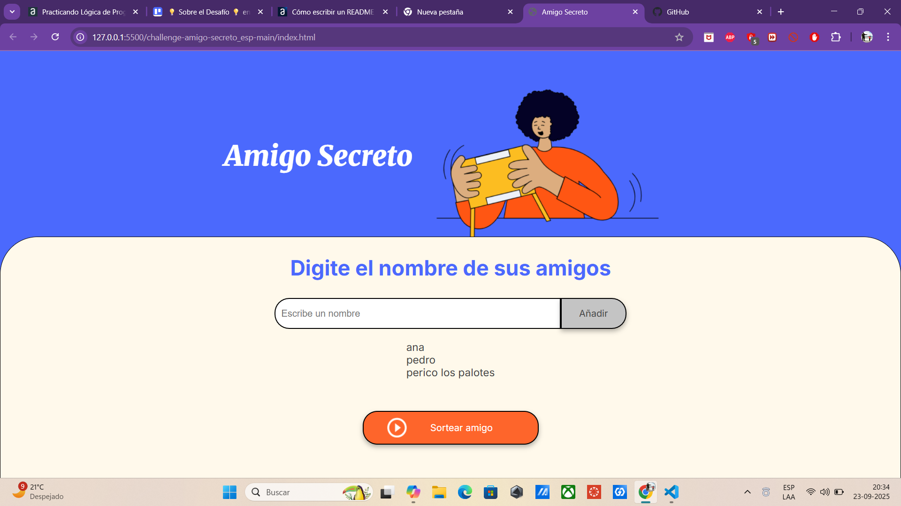
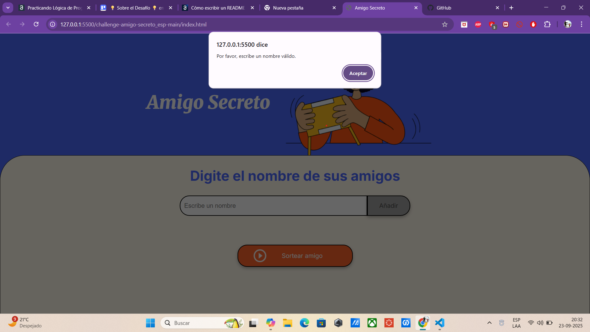
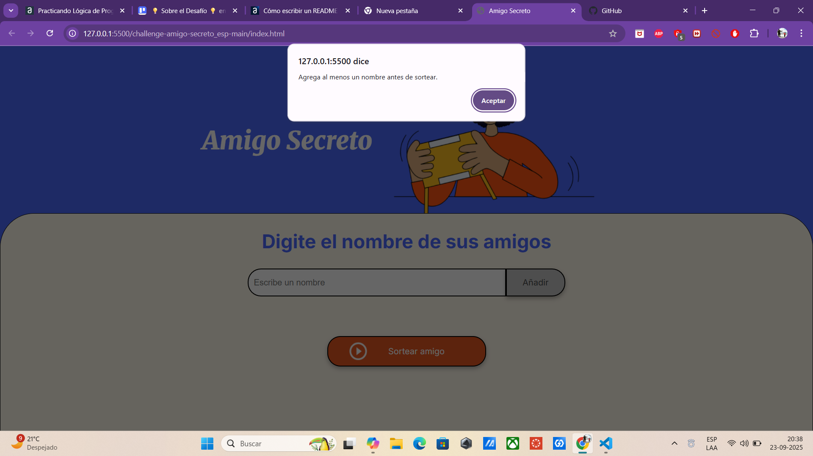
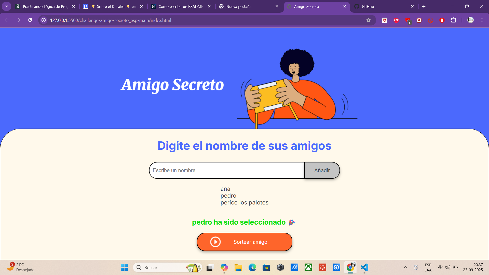

# 🎁 Aplicación Web: Sorteo de Amigo Secreto

Una herramienta interactiva y accesible para organizar sorteos de Amigo Secreto entre amigos, familiares o compañeros de trabajo. Esta aplicación permite agregar nombres, visualizarlos dinámicamente y realizar un sorteo aleatorio con una interfaz amigable y moderna.

🎯 Descripción del desafío
Esta aplicación fue desarrollada como parte de un desafío que consiste en crear una herramienta interactiva para organizar un sorteo de "Amigo Secreto". El objetivo es permitir a los usuarios ingresar nombres en una lista y luego realizar un sorteo aleatorio para determinar quién será el amigo secreto.
🧾 Requisitos funcionales
- Agregar nombres
Los usuarios escribirán el nombre de un amigo en un campo de texto y lo agregarán a una lista visible al hacer clic en el botón "Adicionar".
- Validar entrada
Si el campo de texto está vacío, el programa mostrará una alerta pidiendo un nombre válido.
- Visualizar la lista
Los nombres ingresados aparecerán en una lista debajo del campo de entrada, actualizándose dinámicamente.
- Sorteo aleatorio
Al hacer clic en el botón "Sortear Amigo", se seleccionará aleatoriamente uno de los nombres de la lista y se mostrará el resultado en pantalla.

## 🧩 Tecnologías utilizadas

- HTML5
- CSS3
- JavaScript (Vanilla)
- Google Fonts (Inter & Merriweather)

## 🚀 Funcionalidades principales

- ✅ **Agregar nombres**: Valida que el campo no esté vacío y evita duplicados.
- 📋 **Lista dinámica**: Muestra los nombres agregados en tiempo real.
- 🎲 **Sorteo aleatorio**: Selecciona un nombre al azar y lo muestra en pantalla.
- 🖼️ **Interfaz visual**: Incluye imagen temática y diseño responsivo.
- ♿ **Accesibilidad**: Uso de roles, etiquetas `aria` y estructura semántica.

## 📄 Estructura del proyecto
AmigoSecreto/
├── index.html                    # Página principal con la interfaz del juego
├── style.css                     # Estilos visuales y responsivos
├── app.js                        # Lógica del juego (agregar, validar, sortear)
├── README.md                     # Documentación completa del proyecto
├── assets/                       # Recursos gráficos utilizados en la interfaz
│   ├── amigo-secreto.png         # Imagen decorativa del encabezado
│   └── play_circle_outline.png   # Ícono del botón de sorteo
└── screenshots/                  # Capturas de pantalla que demuestran la funcionalidad
    ├── inicio del juego.png
    ├── agregar nombres.png
    ├── validacion de entrada.png
    ├── agregar un nombre al menos para sortear validacion.png
    └── sorteo aleatorio.png

## 🧪 Casos de prueba..

- Ingresar un nombre válido → Se agrega a la lista.
- Ingresar un nombre duplicado → Muestra una alerta.
- Dejar el campo vacío → Muestra una alerta.
- Presionar "Sortear" sin nombres → Muestra una advertencia.
- Presionar "Sortear" con nombres → Muestra resultado aleatorio.

## 📸 Vista previa de la aplicación
A continuación se muestran capturas de pantalla que ilustran el flujo completo de la aplicación "Amigo Secreto":

### 🧩 Inicio del juego

> La interfaz principal muestra el título, una imagen temática y el campo para ingresar nombres. Todo está centrado y estilizado para una experiencia amigable.

### 📝 Agregar nombres

> El usuario puede escribir nombres en el campo de entrada y presionar "Añadir". Los nombres se muestran automáticamente en la lista inferior.

### ⚠️ Validación de entrada

> Si el campo está vacío o el nombre ya fue ingresado, se muestra una alerta indicando el error. Esto evita duplicados y entradas inválidas.

### 🎯 Validación antes de sortear

> Si se intenta realizar el sorteo sin haber agregado ningún nombre, se muestra una advertencia para asegurar que haya al menos un participante.

### 🎉 Sorteo aleatorio

> Al presionar el botón "Sortear amigo", se selecciona un nombre al azar de la lista y se muestra en pantalla con un mensaje festivo.

## 🧠 Lógica JavaScript (`app.js`)

Contiene la lógica para:

- Validar y agregar nombres
- Renderizar la lista en el DOM
- Realizar el sorteo aleatorio
- Mostrar el resultado en pantalla

## 🖥️ HTML base (`index.html`)

Incluye:

- Encabezado con título e imagen
- Campo de entrada y botón para añadir nombres
- Lista de nombres agregados
- Botón para realizar el sorteo
- Inclusión de fuentes tipográficas y estilos externos

## 🎨 Estilos CSS (`style.css`)

El archivo `style.css` define la apariencia visual de la aplicación. Aquí un resumen de las clases principales:

| Clase CSS             | Descripción                                                                 |
|-----------------------|------------------------------------------------------------------------------|
| `.main-content`       | Contenedor principal con padding y layout centrado                          |
| `.header-banner`      | Encabezado con imagen y título estilizado                                   |
| `.main-title`         | Título principal con fuente Merriweather y peso fuerte                      |
| `.input-section`      | Sección que contiene el input, botones y listas                             |
| `.input-wrapper`      | Agrupa el campo de texto y botón de añadir                                  |
| `.input-name`         | Estilo del campo de entrada                                                  |
| `.button-add`         | Botón para agregar nombres, con hover y transición                           |
| `.button-draw`        | Botón para sortear, con ícono y estilo llamativo                            |
| `.name-list`          | Lista de nombres agregados, con estilo limpio y legible                     |
| `.result-list`        | Lista donde se muestra el nombre sorteado                                   |
| `.button-container`   | Contenedor para centrar el botón de sorteo                                  |

También se incluyen reglas para:

- Tipografía con `Inter` y `Merriweather`
- Colores suaves y contrastes accesibles
- Transiciones suaves en botones
- Diseño responsivo para móviles y pantallas pequeñas

## 📦 Instalación y uso

1. Clona o descarga el repositorio.
2. Asegúrate de tener los archivos `index.html`, `style.css`, `app.js` y la carpeta `assets`.
3. Abre `index.html` en tu navegador.
4. ¡Empieza a agregar nombres y realiza el sorteo!

## 🌐 Demo en vivo

Puedes ver y probar la aplicación directamente aquí:
👉 [https://orlandekee.github.io/AmigoSecreto/](https://orlandekee.github.io/AmigoSecreto/)

## 📄 Licencia
Este proyecto fue creado por Orlando y se distribuye bajo una licencia de uso libre. Puedes modificarlo, compartirlo y adaptarlo según tus necesidades, siempre reconociendo la autoría original.

## 👤 Autor

Desarrollado con 💻 y dedicación por **Orlando**.

## 🙌 Agradecimientos

Gracias a quienes probaron la app y dieron feedback. ¡Tu ayuda mejora este proyecto!.